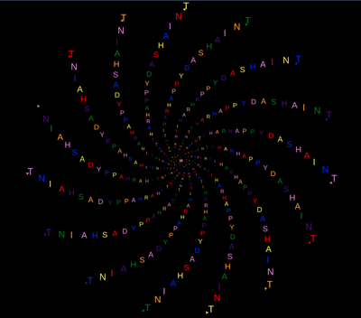

Title: Happy Dashain in Turtle
Date: 2020-10-14 23:25
Category: Turtle

Draw this Happy Dashain and Tihar Spiral using the code that follows

    #!python
    import turtle as t

    # This gives more control of speed t.tracer(refreshes, delay)
    t.tracer(10,1)
    t.write("",font=("Arial", 1, "normal"))
    
    t.Screen().bgcolor("black")
    
    N = 15
    angle = 45
    text="HAPPYDASHAINTIHAR"
    length=len(text)
    colors=["violet","indigo","blue","green","yellow","orange","red"]
    
    turtles = []
    
    for position in range(N):
      look_at = 360/N*position
      color_position=colors[position%len(colors)]
      new = t.Turtle()
      new.setheading(look_at)
      new.color(color_position)
      new.penup()
    
      turtles.append(new)
    
    for radius in range(30):
      character=text[radius % length]
    
      for my in turtles:
        my.circle(radius**1.9, angle)
        my.write(character,font=("Arial", radius, "normal"))

